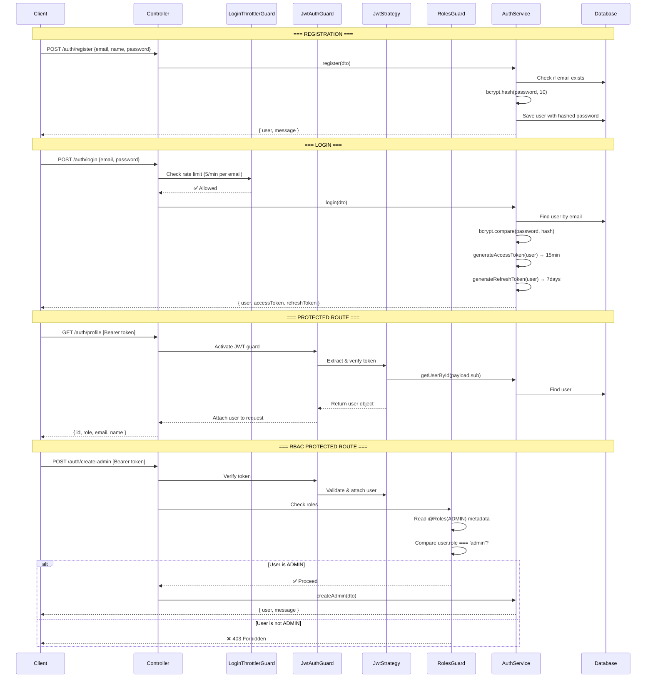

# 🔐 NestJS Authentication & Authorization — Complete Guide

> A step-by-step walkthrough of the **Authentication** (JWT + bcrypt) and **Authorization** (Guards + RBAC) cycle implemented in this project, designed so you can replicate it in any NestJS application.

---

## Table of Contents

1. [Overview & Architecture](#1-overview--architecture)
2. [Step 1 — Install Required Packages](#2-step-1--install-required-packages)
3. [Step 2 — Define the User Entity with Roles](#3-step-2--define-the-user-entity-with-roles)
4. [Step 3 — Create DTOs for Validation](#4-step-3--create-dtos-for-validation)
5. [Step 4 — Password Hashing with bcrypt](#5-step-4--password-hashing-with-bcrypt)
6. [Step 5 — User Registration](#6-step-5--user-registration)
7. [Step 6 — Login & JWT Token Generation](#7-step-6--login--jwt-token-generation)
8. [Step 7 — JWT Strategy (Token Validation)](#8-step-7--jwt-strategy-token-validation)
9. [Step 8 — JWT Auth Guard (Protecting Routes)](#9-step-8--jwt-auth-guard-protecting-routes)
10. [Step 9 — RBAC: Roles Decorator + Roles Guard](#10-step-9--rbac-roles-decorator--roles-guard)
11. [Step 10 — Refresh Tokens](#11-step-10--refresh-tokens)
12. [Step 11 — CurrentUser Decorator](#12-step-11--currentuser-decorator)
13. [Step 12 — Login Throttling Guard](#13-step-12--login-throttling-guard)
14. [Step 13 — Wire Everything in the Auth Module](#14-step-13--wire-everything-in-the-auth-module)
15. [Complete Request Flow Diagram](#15-complete-request-flow-diagram)
16. [Quick-Start Checklist for New Projects](#16-quick-start-checklist-for-new-projects)

---

## 1. Overview & Architecture

The project uses a **layered security architecture**:

| Layer | Technology | Purpose |
|---|---|---|
| **Password Security** | `bcrypt` | Hash & verify passwords — never store plain text |
| **Authentication** | `JWT` via `@nestjs/jwt` + Passport | Prove *who* the user is via signed tokens |
| **Route Protection** | [JwtAuthGuard](file:///e:/Khaled/node%20js/Sangam/nest-js-course-2025/project/src/auth/guards/jwt-auth.guard.ts#6-8) (Passport guard) | Block unauthenticated access to protected routes |
| **Authorization** | [RolesGuard](file:///e:/Khaled/node%20js/Sangam/nest-js-course-2025/project/src/auth/guards/roles-guard.ts#18-54) + `@Roles()` decorator | Allow only users with specific roles (RBAC) |
| **Rate Limiting** | [LoginThrottlerGuard](file:///e:/Khaled/node%20js/Sangam/nest-js-course-2025/project/src/auth/guards/login-throttler.guard.ts#8-31) | Prevent brute-force login attempts |

### File Map

```
src/auth/
├── auth.module.ts              # Module wiring
├── auth.controller.ts          # HTTP endpoints
├── auth.service.ts             # Business logic (register, login, tokens)
├── dto/
│   ├── register.dto.ts         # Registration validation
│   └── login.dto.ts            # Login validation
├── entities/
│   └── user.entity.ts          # User model + UserRole enum
├── strategies/
│   └── jwt.strategy.ts         # Passport JWT strategy (validates tokens)
├── guards/
│   ├── jwt-auth.guard.ts       # Activates the JWT strategy on routes
│   ├── roles-guard.ts          # Checks user roles against required roles
│   └── login-throttler.guard.ts# Rate-limits login attempts
└── decorators/
    ├── roles.decorators.ts     # @Roles() — marks required roles on routes
    └── current-user.decorator.ts # @CurrentUser() — extracts user from request
```

---

## 2. Step 1 — Install Required Packages

```bash
npm install @nestjs/passport passport passport-jwt @nestjs/jwt bcrypt
npm install -D @types/passport-jwt @types/bcrypt
```

| Package | Why |
|---|---|
| `@nestjs/passport` | NestJS integration with Passport.js |
| `passport` + `passport-jwt` | JWT authentication strategy |
| `@nestjs/jwt` | JWT signing and verification |
| `bcrypt` | Industry-standard password hashing |

---

## 3. Step 2 — Define the User Entity with Roles

📄 [user.entity.ts](file:///e:/Khaled/node%20js/Sangam/nest-js-course-2025/project/src/auth/entities/user.entity.ts)

First, define a `UserRole` enum — this is the foundation of RBAC:

```typescript
export enum UserRole {
  USER = 'user',
  ADMIN = 'admin',
}
```

Then create the [User](file:///e:/Khaled/node%20js/Sangam/nest-js-course-2025/project/src/auth/entities/user.entity.ts#16-46) entity with TypeORM:

```typescript
@Entity()
export class User {
  @PrimaryGeneratedColumn()
  id: number;

  @Column({ unique: true })
  email: string;

  @Column()
  name: string;

  @Column()
  password: string;  // Will store the bcrypt hash

  @Column({
    type: 'enum',
    enum: UserRole,
    default: UserRole.USER,  // New users are 'user' by default
  })
  role: UserRole;

  @CreateDateColumn()
  createdAt: Date;

  @UpdateDateColumn()
  updatedAt: Date;
}
```

> [!IMPORTANT]
> The `role` column uses a Postgres `enum` type with a default of `USER`. This means every registered user gets the `user` role unless explicitly promoted to `admin`.

---

## 4. Step 3 — Create DTOs for Validation

DTOs validate incoming data **before** it reaches the service.

📄 [register.dto.ts](file:///e:/Khaled/node%20js/Sangam/nest-js-course-2025/project/src/auth/dto/register.dto.ts)

```typescript
export class RegisterDto {
  @IsEmail({}, { message: 'Please provide a valid email' })
  email: string;

  @IsNotEmpty()
  @IsString()
  @MinLength(3)
  @MaxLength(50)
  name: string;

  @IsNotEmpty()
  @MinLength(6)
  password: string;
}
```

📄 [login.dto.ts](file:///e:/Khaled/node%20js/Sangam/nest-js-course-2025/project/src/auth/dto/login.dto.ts)

```typescript
export class LoginDto {
  @IsEmail({}, { message: 'Please provide a valid email' })
  email: string;

  @IsNotEmpty()
  @MinLength(6)
  password: string;
}
```

---

## 5. Step 4 — Password Hashing with bcrypt

📄 [auth.service.ts](file:///e:/Khaled/node%20js/Sangam/nest-js-course-2025/project/src/auth/auth.service.ts) — private methods

**bcrypt** ensures passwords are never stored as plain text. It uses a **salt round** (cost factor) to make hashing computationally expensive for attackers.

```typescript
// Hash a plain-text password with 10 salt rounds
private async hashPassword(password: string): Promise<string> {
  return bcrypt.hash(password, 10);
}

// Compare a plain-text password against a stored hash
private async verifyPassword(
  plainPassword: string,
  hashedPassword: string,
): Promise<boolean> {
  return bcrypt.compare(plainPassword, hashedPassword);
}
```

**How it works:**
1. `bcrypt.hash('myPassword', 10)` → produces a string like `$2b$10$N9qo8uLOickgx2ZMR...`
2. `bcrypt.compare('myPassword', hash)` → returns `true` if they match
3. The salt is embedded **inside** the hash, so you don't need to store it separately

> [!TIP]
> The `10` in `bcrypt.hash(password, 10)` is the salt rounds. Higher = more secure but slower. `10` is a good default; use `12` for extra-sensitive systems.

---

## 6. Step 5 — User Registration

📄 [auth.service.ts](file:///e:/Khaled/node%20js/Sangam/nest-js-course-2025/project/src/auth/auth.service.ts#L26-L56) — [register()](file:///e:/Khaled/node%20js/Sangam/nest-js-course-2025/project/src/auth/auth.service.ts#26-57) method

```typescript
async register(registerDto: RegisterDto) {
  // 1. Check if email is already taken
  const existingUser = await this.usersRepository.findOne({
    where: { email: registerDto.email },
  });

  if (existingUser) {
    throw new ConflictException('Email already in use!');
  }

  // 2. Hash the password
  const hashedPassword = await this.hashPassword(registerDto.password);

  // 3. Create the user with 'user' role
  const newlyCreatedUser = this.usersRepository.create({
    email: registerDto.email,
    name: registerDto.name,
    password: hashedPassword,
    role: UserRole.USER,
  });

  // 4. Save to database
  const savedUser = await this.usersRepository.save(newlyCreatedUser);

  // 5. Strip password from response
  const { password, ...result } = savedUser;
  return {
    user: result,
    message: 'Registration successfully! Please login to continue',
  };
}
```

**Key points:**
- Password is hashed **before** saving — the database never sees plain text
- The response **strips the password field** using destructuring
- Role is hard-coded to `UserRole.USER` — users can't self-assign `ADMIN`

---

## 7. Step 6 — Login & JWT Token Generation

📄 [auth.service.ts](file:///e:/Khaled/node%20js/Sangam/nest-js-course-2025/project/src/auth/auth.service.ts#L86-L107) — [login()](file:///e:/Khaled/node%20js/Sangam/nest-js-course-2025/project/src/auth/auth.controller.ts#23-26) method

### Login Flow

```typescript
async login(loginDto: LoginDto) {
  // 1. Find user by email
  const user = await this.usersRepository.findOne({
    where: { email: loginDto.email },
  });

  // 2. Verify password with bcrypt
  if (!user || !(await this.verifyPassword(loginDto.password, user.password))) {
    throw new UnauthorizedException('Invalid credentials or account not exists');
  }

  // 3. Generate JWT tokens
  const tokens = this.generateTokens(user);

  // 4. Return user data + tokens
  const { password, ...result } = user;
  return { user: result, ...tokens };
}
```

### Token Generation

The project uses a **dual token system** — an **access token** (short-lived) and a **refresh token** (long-lived):

```typescript
// ACCESS TOKEN — sent with every API request
private generateAccessToken(user: User): string {
  const payload = {
    email: user.email,
    sub: user.id,        // Standard JWT claim for subject (user ID)
    role: user.role,     // Embedded for RBAC — no extra DB query needed
  };

  return this.jwtService.sign(payload, {
    secret: 'jwt_secret',
    expiresIn: '15m',    // Short-lived for security
  });
}

// REFRESH TOKEN — used to get a new access token
private generateRefreshToken(user: User): string {
  const payload = { sub: user.id };

  return this.jwtService.sign(payload, {
    secret: 'refresh_secret',  // Different secret from access token!
    expiresIn: '7d',           // Long-lived
  });
}
```

> [!IMPORTANT]
> The access token **embeds the user's role** in the payload. This is critical — the [RolesGuard](file:///e:/Khaled/node%20js/Sangam/nest-js-course-2025/project/src/auth/guards/roles-guard.ts#18-54) later reads this role to perform authorization without hitting the database.

### Login Response Example

```json
{
  "user": {
    "id": 1,
    "email": "khaled@example.com",
    "name": "Khaled",
    "role": "user"
  },
  "acccessToken": "eyJhbGciOiJIUzI1NiIs...",
  "refreshToken": "eyJhbGciOiJIUzI1NiIs..."
}
```

---

## 8. Step 7 — JWT Strategy (Token Validation)

📄 [jwt.strategy.ts](file:///e:/Khaled/node%20js/Sangam/nest-js-course-2025/project/src/auth/strategies/jwt.strategy.ts)

The **strategy** tells Passport *how* to validate incoming JWTs:

```typescript
@Injectable()
export class JwtStrategy extends PassportStrategy(Strategy) {
  constructor(private authService: AuthService) {
    super({
      // 1. Extract token from "Authorization: Bearer <token>" header
      jwtFromRequest: ExtractJwt.fromAuthHeaderAsBearerToken(),
      // 2. Reject expired tokens
      ignoreExpiration: false,
      // 3. Use the same secret as token generation
      secretOrKey: 'jwt_secret',
    });
  }

  // 4. Called AFTER Passport verifies the token signature & expiry
  async validate(payload: any) {
    try {
      // 5. Fetch fresh user data from DB (ensures user still exists)
      const user = await this.authService.getUserById(payload.sub);

      // 6. Return user object → gets attached to request.user
      return {
        id: user.id,
        role: user.role,
        email: user.email,
        name: user.name,
      };
    } catch (error) {
      throw new UnauthorizedException('Invalid token');
    }
  }
}
```

**What happens under the hood:**
1. Passport intercepts the request and extracts the Bearer token
2. It verifies the token's **signature** using `jwt_secret`
3. It checks the token's **expiry** (`15m`)
4. If valid, it calls [validate(payload)](file:///e:/Khaled/node%20js/Sangam/nest-js-course-2025/project/src/auth/strategies/jwt.strategy.ts#16-30) with the decoded JWT payload
5. The [validate()](file:///e:/Khaled/node%20js/Sangam/nest-js-course-2025/project/src/auth/strategies/jwt.strategy.ts#16-30) method fetches the user from the DB to confirm they still exist
6. The returned object is **automatically attached** to `request.user`

---

## 9. Step 8 — JWT Auth Guard (Protecting Routes)

📄 [jwt-auth.guard.ts](file:///e:/Khaled/node%20js/Sangam/nest-js-course-2025/project/src/auth/guards/jwt-auth.guard.ts)

```typescript
@Injectable()
export class JwtAuthGuard extends AuthGuard('jwt') {}
```

That's it — just one line! This guard **activates** the [JwtStrategy](file:///e:/Khaled/node%20js/Sangam/nest-js-course-2025/project/src/auth/strategies/jwt.strategy.ts#6-31) defined above. It's the bridge between your route and Passport.

### Usage in Controllers

```typescript
// Any authenticated user can access
@UseGuards(JwtAuthGuard)
@Get('profile')
getProfile(@CurrentUser() user: any) {
  return user;
}
```

**When `@UseGuards(JwtAuthGuard)` is on a route:**
1. Guard intercepts the request **before** the controller method
2. Triggers the JWT Passport strategy
3. If token is invalid or missing → automatic `401 Unauthorized`
4. If valid → `request.user` is populated, controller executes

> [!NOTE]
> [JwtAuthGuard](file:///e:/Khaled/node%20js/Sangam/nest-js-course-2025/project/src/auth/guards/jwt-auth.guard.ts#6-8) is also used in other modules like `PostsController` and `FileUploadController` to protect their endpoints.

---

## 10. Step 9 — RBAC: Roles Decorator + Roles Guard

This is the **Authorization** layer — controlling *what* an authenticated user can do.

### Part A: The `@Roles()` Decorator

📄 [roles.decorators.ts](file:///e:/Khaled/node%20js/Sangam/nest-js-course-2025/project/src/auth/decorators/roles.decorators.ts)

```typescript
export const ROLES_KEY = 'roles';

export const Roles = (...roles: UserRole[]) => SetMetadata(ROLES_KEY, roles);
```

**What it does:** Attaches metadata to a route handler saying "only these roles are allowed." It **does NOT enforce anything** by itself — it just tags the route.

### Part B: The [RolesGuard](file:///e:/Khaled/node%20js/Sangam/nest-js-course-2025/project/src/auth/guards/roles-guard.ts#18-54)

📄 [roles-guard.ts](file:///e:/Khaled/node%20js/Sangam/nest-js-course-2025/project/src/auth/guards/roles-guard.ts)

```typescript
@Injectable()
export class RolesGuard implements CanActivate {
  constructor(private reflector: Reflector) {}

  canActivate(context: ExecutionContext): boolean {
    // 1. Read roles metadata set by @Roles() decorator
    const requiredRoles = this.reflector.getAllAndOverride<UserRole[]>(
      ROLES_KEY,
      [
        context.getHandler(), // Check method-level metadata
        context.getClass(),   // Check class-level metadata
      ],
    );

    // 2. If no @Roles() found, allow access (no restriction)
    if (!requiredRoles) {
      return true;
    }

    // 3. Get user from request (attached by JwtAuthGuard)
    const { user } = context.switchToHttp().getRequest();

    if (!user) {
      throw new ForbiddenException('User not authenticated');
    }

    // 4. Check if user's role matches any required role
    const hasRequiredRole = requiredRoles.some((role) => user.role === role);

    if (!hasRequiredRole) {
      throw new ForbiddenException('Insufficient permission');
    }

    return true;
  }
}
```

### Usage: Combining Both Guards

```typescript
// Only ADMIN users can create other admins
@Post('create-admin')
@Roles(UserRole.ADMIN)                    // ← Tag: requires ADMIN role
@UseGuards(JwtAuthGuard, RolesGuard)      // ← Guards execute left-to-right
createAdmin(@Body() registerDto: RegisterDto) {
  return this.authService.createAdmin(registerDto);
}
```

> [!CAUTION]
> **Guard order matters!** [JwtAuthGuard](file:///e:/Khaled/node%20js/Sangam/nest-js-course-2025/project/src/auth/guards/jwt-auth.guard.ts#6-8) must come **before** [RolesGuard](file:///e:/Khaled/node%20js/Sangam/nest-js-course-2025/project/src/auth/guards/roles-guard.ts#18-54) because [RolesGuard](file:///e:/Khaled/node%20js/Sangam/nest-js-course-2025/project/src/auth/guards/roles-guard.ts#18-54) needs `request.user` which is only set after [JwtAuthGuard](file:///e:/Khaled/node%20js/Sangam/nest-js-course-2025/project/src/auth/guards/jwt-auth.guard.ts#6-8) runs. If you reverse the order, you'll get `ForbiddenException: User not authenticated`.

### The RBAC Flow

```
Request → JwtAuthGuard → RolesGuard → Controller
              │               │
              │               ├─ Read @Roles() metadata
              │               ├─ Compare user.role with required roles
              │               └─ Allow or throw ForbiddenException
              │
              ├─ Extract Bearer token
              ├─ Verify signature + expiry
              ├─ Call JwtStrategy.validate()
              └─ Attach user to request
```

---

## 11. Step 10 — Refresh Tokens

📄 [auth.service.ts](file:///e:/Khaled/node%20js/Sangam/nest-js-course-2025/project/src/auth/auth.service.ts#L109-L129) — [refreshToken()](file:///e:/Khaled/node%20js/Sangam/nest-js-course-2025/project/src/auth/auth.controller.ts#28-31) method

When the access token expires (after 15 min), the client sends the refresh token to get a new access token **without re-entering credentials**:

```typescript
async refreshToken(refreshToken: string) {
  try {
    // 1. Verify refresh token with its OWN secret
    const payload = this.jwtService.verify(refreshToken, {
      secret: 'refresh_secret',
    });

    // 2. Ensure user still exists
    const user = await this.usersRepository.findOne({
      where: { id: payload.sub },
    });

    if (!user) {
      throw new UnauthorizedException('Invalid token');
    }

    // 3. Generate a NEW access token
    const acccessToken = this.generateAccessToken(user);
    return { acccessToken };
  } catch (e) {
    throw new UnauthorizedException('Invalid token');
  }
}
```

### Controller Endpoint

```typescript
@Post('refresh')
refreshToken(@Body('refreshToken') refreshToken: string) {
  return this.authService.refreshToken(refreshToken);
}
```

---

## 12. Step 11 — CurrentUser Decorator

📄 [current-user.decorator.ts](file:///e:/Khaled/node%20js/Sangam/nest-js-course-2025/project/src/auth/decorators/current-user.decorator.ts)

A convenience decorator that extracts the user from `request.user`:

```typescript
export const CurrentUser = createParamDecorator(
  (data: unknown, ctx: ExecutionContext) => {
    const request = ctx.switchToHttp().getRequest();
    return request.user;
  },
);
```

**Usage:**

```typescript
@UseGuards(JwtAuthGuard)
@Get('profile')
getProfile(@CurrentUser() user: any) {
  return user;  // { id, role, email, name }
}
```

---

## 13. Step 12 — Login Throttling Guard

📄 [login-throttler.guard.ts](file:///e:/Khaled/node%20js/Sangam/nest-js-course-2025/project/src/auth/guards/login-throttler.guard.ts)

Prevents brute-force login attacks by limiting attempts **per email**:

```typescript
@Injectable()
export class LoginThrottlerGuard extends ThrottlerGuard {
  // Track by email, not IP — prevents credential stuffing
  protected async getTracker(req: Record<string, any>): Promise<string> {
    const email = req.body?.email || 'anonymous';
    return `login-${email}`;
  }

  // Max 5 login attempts
  protected getLimit(): Promise<number> {
    return Promise.resolve(5);
  }

  // Per 1-minute window
  protected getTtl(): Promise<number> {
    return Promise.resolve(60000);
  }

  protected async throwThrottlingException(): Promise<void> {
    throw new ThrottlerException(
      'Too many attempts. Please try again after 1 minute',
    );
  }
}
```

**Applied to the login endpoint:**

```typescript
@UseGuards(LoginThrottlerGuard)
@Post('login')
login(@Body() loginDto: LoginDto) { ... }
```

---

## 14. Step 13 — Wire Everything in the Auth Module

📄 [auth.module.ts](file:///e:/Khaled/node%20js/Sangam/nest-js-course-2025/project/src/auth/auth.module.ts)

```typescript
@Module({
  imports: [
    TypeOrmModule.forFeature([User]),  // Makes User repository injectable
    PassportModule,                     // Enables Passport strategies
    JwtModule.register({}),             // Enables JwtService (config is per-sign call)
  ],
  controllers: [AuthController],
  providers: [
    AuthService,     // Business logic
    JwtStrategy,     // Makes the 'jwt' strategy available
    RolesGuard,      // Available for injection
  ],
  exports: [
    AuthService,     // Other modules can use AuthService
    RolesGuard,      // Other modules can use RolesGuard
  ],
})
export class AuthModule {}
```

> [!NOTE]
> [AuthService](file:///e:/Khaled/node%20js/Sangam/nest-js-course-2025/project/src/auth/auth.service.ts#15-192) and [RolesGuard](file:///e:/Khaled/node%20js/Sangam/nest-js-course-2025/project/src/auth/guards/roles-guard.ts#18-54) are **exported** so other modules (like `PostsModule`, `FileUploadModule`) can import [AuthModule](file:///e:/Khaled/node%20js/Sangam/nest-js-course-2025/project/src/auth/auth.module.ts#12-31) and use [JwtAuthGuard](file:///e:/Khaled/node%20js/Sangam/nest-js-course-2025/project/src/auth/guards/jwt-auth.guard.ts#6-8) + [RolesGuard](file:///e:/Khaled/node%20js/Sangam/nest-js-course-2025/project/src/auth/guards/roles-guard.ts#18-54) on their own routes.

---

## 15. Complete Request Flow Diagram



---

## 16. Quick-Start Checklist for New Projects

Use this checklist to replicate the same auth system in any NestJS project:

- [ ] **1. Install packages** — `@nestjs/passport`, `passport`, `passport-jwt`, `@nestjs/jwt`, `bcrypt`
- [ ] **2. Create User entity** — with `email`, `password`, and `role` (enum: `user`/`admin`)
- [ ] **3. Create DTOs** — [RegisterDto](file:///e:/Khaled/node%20js/Sangam/nest-js-course-2025/project/src/auth/dto/register.dto.ts#9-23) and [LoginDto](file:///e:/Khaled/node%20js/Sangam/nest-js-course-2025/project/src/auth/dto/login.dto.ts#3-11) with `class-validator` decorators
- [ ] **4. Create AuthService** — implement:
  - [hashPassword()](file:///e:/Khaled/node%20js/Sangam/nest-js-course-2025/project/src/auth/auth.service.ts#149-152) — `bcrypt.hash(password, 10)`
  - [verifyPassword()](file:///e:/Khaled/node%20js/Sangam/nest-js-course-2025/project/src/auth/auth.service.ts#153-159) — `bcrypt.compare(plain, hash)`
  - [register()](file:///e:/Khaled/node%20js/Sangam/nest-js-course-2025/project/src/auth/auth.service.ts#26-57) — check duplicate, hash, save, strip password from response
  - [login()](file:///e:/Khaled/node%20js/Sangam/nest-js-course-2025/project/src/auth/auth.controller.ts#23-26) — find by email, verify, generate tokens
  - [generateAccessToken()](file:///e:/Khaled/node%20js/Sangam/nest-js-course-2025/project/src/auth/auth.service.ts#167-180) — sign with `{ email, sub: id, role }`, 15min expiry
  - [generateRefreshToken()](file:///e:/Khaled/node%20js/Sangam/nest-js-course-2025/project/src/auth/auth.service.ts#181-191) — sign with `{ sub: id }`, 7day expiry
  - [refreshToken()](file:///e:/Khaled/node%20js/Sangam/nest-js-course-2025/project/src/auth/auth.controller.ts#28-31) — verify refresh token, return new access token
- [ ] **5. Create JwtStrategy** — extends `PassportStrategy(Strategy)`, extract Bearer token, validate with DB lookup
- [ ] **6. Create JwtAuthGuard** — extends [AuthGuard('jwt')](file:///e:/Khaled/node%20js/Sangam/nest-js-course-2025/project/src/auth/guards/jwt-auth.guard.ts#6-8) (one-liner)
- [ ] **7. Create @Roles() decorator** — uses `SetMetadata` to tag routes with required roles
- [ ] **8. Create RolesGuard** — implements `CanActivate`, uses `Reflector` to read role metadata and compare against `request.user.role`
- [ ] **9. Create @CurrentUser() decorator** — `createParamDecorator` that returns `request.user`
- [ ] **10. Create AuthModule** — import `TypeOrmModule`, `PassportModule`, `JwtModule`; register providers and exports
- [ ] **11. Protect routes** — use `@UseGuards(JwtAuthGuard)` for auth-only, add `@Roles()` + [RolesGuard](file:///e:/Khaled/node%20js/Sangam/nest-js-course-2025/project/src/auth/guards/roles-guard.ts#18-54) for RBAC
- [ ] **12. (Optional) Add LoginThrottlerGuard** — extend [ThrottlerGuard](file:///e:/Khaled/node%20js/Sangam/nest-js-course-2025/project/src/auth/guards/login-throttler.guard.ts#8-31), track by email, set limit + TTL

> [!TIP]
> **Remember the golden rule:** [JwtAuthGuard](file:///e:/Khaled/node%20js/Sangam/nest-js-course-2025/project/src/auth/guards/jwt-auth.guard.ts#6-8) always comes **before** [RolesGuard](file:///e:/Khaled/node%20js/Sangam/nest-js-course-2025/project/src/auth/guards/roles-guard.ts#18-54) in the `@UseGuards()` decorator, because RBAC depends on the user being authenticated first.
